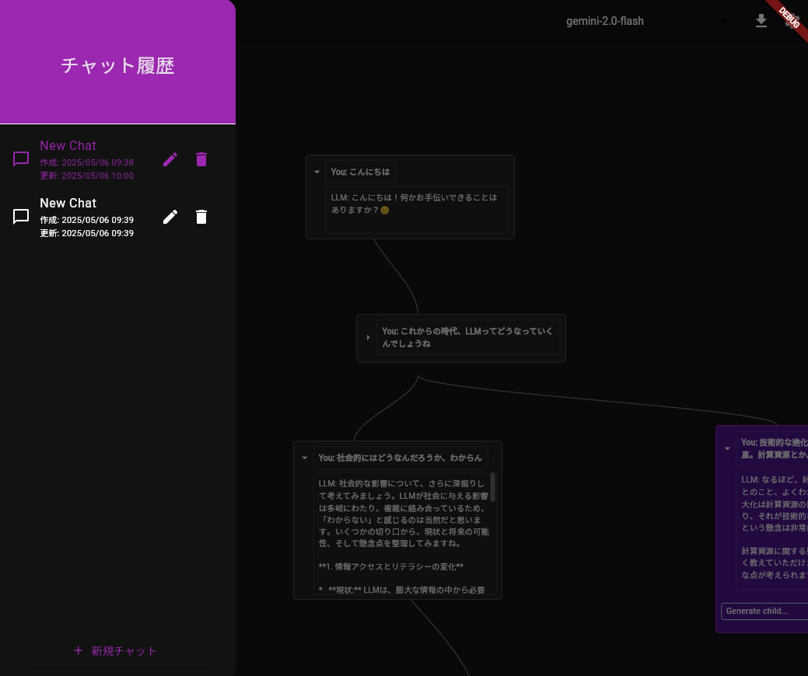

# LLM Graph Chat

FlutterベースのLLMチャットアプリケーションで、チャット履歴をグラフ構造で可視化します。
https://komoriyuta.github.io/llm_graph_chat/




## セットアップ

1. 依存関係のインストール:
```bash
flutter pub get
```

2. コード生成の実行:
```bash
flutter pub run build_runner build --delete-conflicting-outputs
```

3. Gemini APIキーの設定:
アプリ起動時に設定画面でAPIキーを入力

## TODO
- ほかのLLMへの対応
- チャット履歴のファイル保存・書き出しなど
- ストリーム出力
- ノードの種類・色の追加
- 全体的な体験の向上
