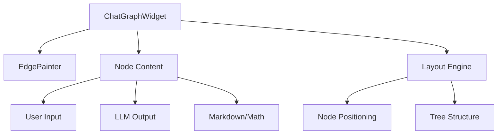
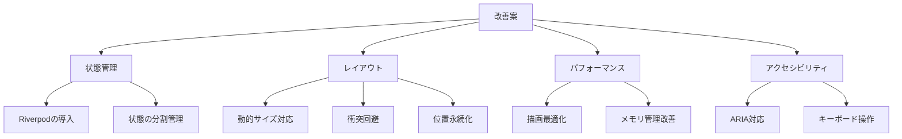

# ChatGraphWidget コード分析

## 概要

[`ChatGraphWidget`](../lib/widgets/chat_graph.dart) は、チャットの履歴をグラフ構造として視覚化するFlutterウィジェットです。ユーザー入力とLLMの応答を親子関係を持つノードとして表現し、インタラクティブな操作を可能にします。

## 主要コンポーネント

### 1. グラフ管理 (ChatGraphWidget)

- **状態管理**:
  - ノードの位置情報 (`_nodePositions`)
  - フォーカス中のノードID (`_focusedNodeId`)
  - ドラッグモード状態 (`_isDragMode`)
  - スクロールコントローラー群

- **レイアウト制御**:
  - InteractiveViewer によるズーム・パン操作
  - ドラッグ＆ドロップによるノード位置の手動調整
  - グリッドスナップ機能

### 2. エッジ描画 (EdgePainter)

- CustomPainter を使用した接続線の描画
- ベジェ曲線による滑らかな線の表現
- 選択状態に応じた線のスタイル変更

### 3. ノード表示 (Node Content)

- ユーザー入力とLLM出力の表示
- Markdown形式のテキストレンダリング
  - 数式表示 (flutter_math_fork)
  - コードブロック表示
  - インラインコード表示
- 折りたたみ/展開機能
- 子ノード生成インターフェース

### 4. レイアウトエンジン

- ツリー構造を基にした自動レイアウト
- 再帰的なノード位置計算
- 折りたたみ状態の考慮

## 課題と改善点

### アーキテクチャ上の課題

1. **状態管理の複雑さ**
   - 多くの状態がStatefulWidgetのState内で管理されている
   - スクロールコントローラーの生存期間管理が不明確
   - Providerの活用が限定的

2. **レイアウトアルゴリズムの制限**
   - 固定サイズのノードを前提とした設計
   - 複雑なグラフ構造への対応が不十分
   - ノードの重なり検出・回避機能の欠如

3. **永続化の不明確さ**
   - 手動で調整したノード位置の永続化方法が実装されていない

### パフォーマンスの懸念

1. **描画パフォーマンス**
   - EdgePainterの再描画条件が不完全
   - 多数のノードがある場合の描画負荷

2. **メモリ管理**
   - スクロールコントローラーの解放タイミング
   - ノード削除時のリソース管理

### アクセシビリティ

- スクリーンリーダー対応が不十分
- キーボード操作のサポートが限定的

## 改善提案

### 1. 状態管理の改善

- Riverpodを導入し、状態管理を整理
- ノード位置やスクロール状態を個別のProviderとして管理
- 状態の永続化戦略の確立

### 2. レイアウトの拡張

- 動的なノードサイズに対応したレイアウトアルゴリズム
- Force-directed layoutの導入による自動ノード配置
- 位置の永続化機能の実装

### 3. パフォーマンス最適化

- EdgePainterの再描画条件の最適化
- ノードの仮想化によるメモリ使用量の削減
- 効率的なリソース解放の実装

### 4. アクセシビリティ対応

- ARIAラベルとロールの追加
- キーボードナビゲーションの実装
- スクリーンリーダー用の構造化された情報提供

## 技術的負債

1. **コードの肥大化**
   - `_ChatGraphWidgetState` クラスの責務が多すぎる
   - ロジックの分割とリファクタリングが必要

2. **テスト容易性**
   - ビジネスロジックとUIの密結合
   - テスト可能な設計への移行が必要

3. **拡張性**
   - 新機能追加時の影響範囲が大きい
   - モジュール化とインターフェース設計の見直しが必要