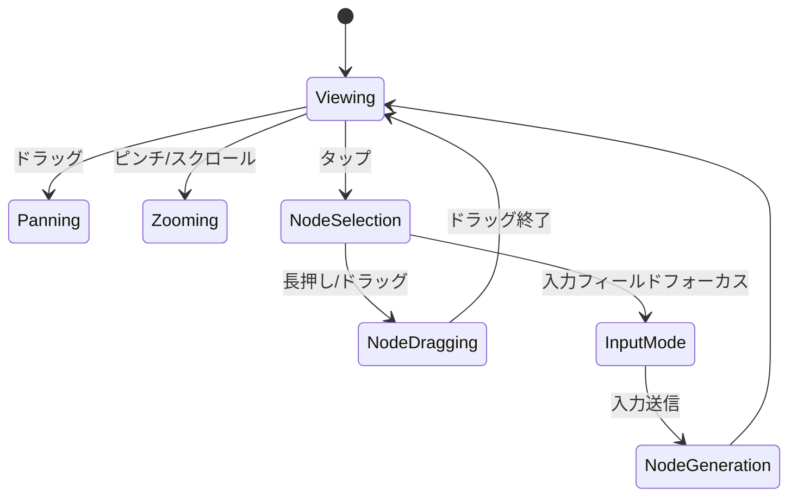
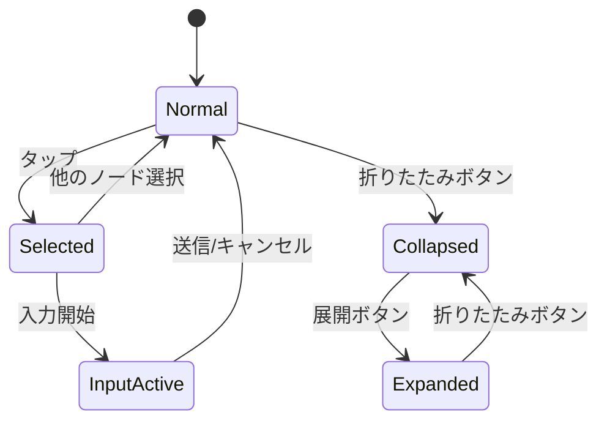
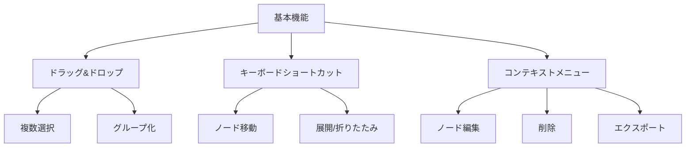

# ChatGraph インタラクションフロー分析

## ユーザーインタラクション

### 1. グラフ操作

### 2. ノード状態遷移

## インタラクションの分析

### 1. 基本操作の流れ

1. **グラフ表示**
   - InteractiveViewerによるズーム/パン
   - ノード位置の自動計算
   - エッジの描画

2. **ノード選択**
   - タップによる選択
   - 選択状態の視覚的フィードバック
   - 入力フィールドの表示

3. **ノード生成**
   - テキスト入力
   - 送信ボタン/Enterキーでの確定
   - 新ノードの追加とレイアウト再計算

4. **ノード移動**
   - ドラッグ開始の判定
   - 位置更新とエッジの再描画
   - グリッドスナップ（オプション）

### 2. エラーハンドリング

現状の実装では以下のエラーケースが考慮されていない、または不十分：

1. **入力バリデーション**
   - 空文字列の処理
   - 長文入力時の表示制御
   - 特殊文字のエスケープ

2. **状態の整合性**
   - 非存在ノードの参照
   - 無効な親子関係
   - 循環参照の防止

3. **リソース管理**
   - スクロールコントローラーの解放
   - アニメーション完了前のノード削除

## UI/UX改善提案

### 1. インタラクションの拡張

### 2. 視覚的フィードバック

1. **アニメーション**
   - ノード展開/折りたたみ
   - 新ノード生成
   - 位置変更

2. **状態表示**
   - 処理中インジケータ
   - エラー表示
   - 選択状態の明確化

3. **アクセシビリティ**
   - フォーカス表示の改善
   - キーボード操作のヒント
   - スクリーンリーダー対応

### 3. レスポンシブ対応

1. **画面サイズ対応**
   - モバイル向けレイアウト
   - タッチ操作の最適化
   - ノードサイズの動的調整

2. **パフォーマンス**
   - 描画の最適化
   - メモリ使用量の制御
   - スムーズなスクロール

## 改善のロードマップ

1. **Phase 1: 基本的な改善**
   - エラーハンドリングの実装
   - キーボード操作のサポート
   - 基本的なアクセシビリティ対応

2. **Phase 2: インタラクション拡張**
   - 複数選択機能
   - コンテキストメニュー
   - アニメーションの改善

3. **Phase 3: 高度な機能**
   - ノードのグループ化
   - 検索・フィルタリング
   - データのインポート/エクスポート

4. **Phase 4: 最適化**
   - パフォーマンスチューニング
   - メモリ使用量の最適化
   - レスポンシブ対応の強化

各フェーズの実装において、ユーザーテストとフィードバックを重視し、段階的な改善を行うことを推奨します。