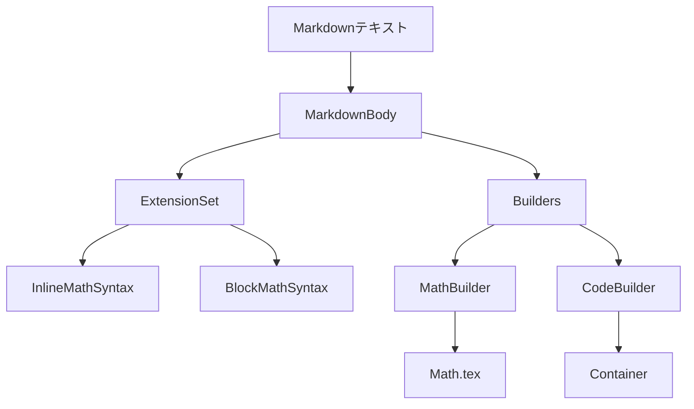
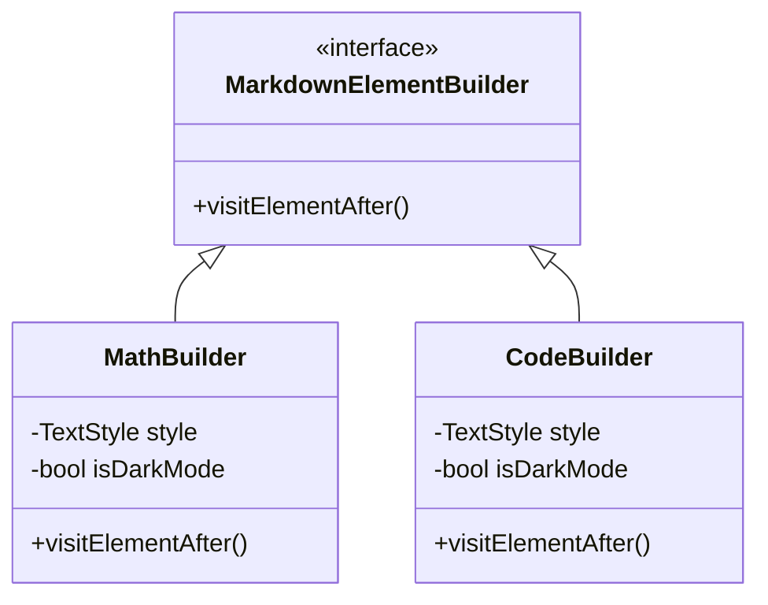

# ChatGraph レンダリング実装分析

## レンダリングシステムの概要



## 1. カスタムビルダーの実装

### MathBuilder

```dart
MathBuilder(
  style.copyWith(
    fontSize: style.fontSize! * 1.1,
    height: 1.8,
    letterSpacing: 0.5,
    leadingDistribution: TextLeadingDistribution.even,
  ),
  isDarkMode: isDarkMode,
)
```

#### 特徴と課題

1. **スタイリング**
   - フォントサイズの動的調整
   - 行高とレタースペーシングの最適化
   - ダークモード対応

2. **レイアウト制御**
   - ブロック数式とインライン数式の区別
   - スクロール可能なコンテナの使用
   - マージンとパディングの調整

3. **エラーハンドリング**
   - パース失敗時の視覚的フィードバック
   - エラーメッセージの表示

### CodeBuilder

```dart
CodeBuilder(
  style.copyWith(
    fontSize: style.fontSize,
    height: 1.5,
  ),
  isDarkMode: isDarkMode,
)
```

#### 実装の特徴

1. **スタイリング**
   - モノスペースフォントの適用
   - 背景色の動的切り替え
   - ボーダーとボーダーラディウスの設定

2. **レイアウト**
   - インラインコードとコードブロックの区別
   - パディングの適切な設定

## 2. レンダリングの最適化

### 現状の課題

1. **パフォーマンス**
   ```mermaid
   graph TD
       A[レンダリングの課題] --> B[再レンダリング]
       A --> C[メモリ使用]
       A --> D[レイアウト計算]
       
       B --> B1[不要な更新]
       B --> B2[キャッシュなし]
       
       C --> C1[テキストスパン]
       C --> C2[数式オブジェクト]
       
       D --> D1[レイアウトシフト]
       D --> D2[サイズ計算]
   ```

2. **メモリ使用**
   - 数式オブジェクトの生成と破棄
   - テキストスパンの蓄積
   - スクロールビューのキャッシュ

### 最適化提案

1. **レンダリング効率**
   - メモ化によるキャッシング
   - 遅延レンダリングの導入
   - 仮想化スクロールの実装

2. **メモリ管理**
   - オブジェクトプーリング
   - 不要なインスタンスの適切な破棄
   - キャッシュサイズの制限

## 3. 拡張性と保守性

### 現状のアーキテクチャ



### 改善提案

1. **アーキテクチャの改善**
   - ビルダーの責務分割
   - スタイリングロジックの分離
   - テスト容易性の向上

2. **新機能のサポート**
   - シンタックスハイライト
   - 数式のインタラクティブ編集
   - カスタムブロックの追加

## 4. テスト戦略

### 必要なテスト

1. **ユニットテスト**
   - パース処理
   - スタイル計算
   - エラーハンドリング

2. **ウィジェットテスト**
   - レンダリング結果
   - インタラクション
   - レイアウト動作

3. **パフォーマンステスト**
   - レンダリング時間
   - メモリ使用量
   - スクロール性能

## 5. 改善ロードマップ

### Phase 1: 基盤強化
- レンダリングエンジンの最適化
- メモリ管理の改善
- 基本的なテストカバレッジ

### Phase 2: 機能拡張
- シンタックスハイライトの導入
- カスタムブロックのサポート
- インタラクティブ機能

### Phase 3: パフォーマンス最適化
- キャッシング戦略の実装
- 仮想化スクロールの導入
- メモリ使用量の最適化

### Phase 4: 品質向上
- テストカバレッジの向上
- エラーハンドリングの強化
- ドキュメントの充実

## 6. まとめ

現状の実装は基本的な機能を提供していますが、以下の点で改善の余地があります：

1. **パフォーマンス**
   - レンダリングの最適化
   - メモリ使用量の削減
   - キャッシング戦略の導入

2. **保守性**
   - コードの責務分割
   - テスト容易性の向上
   - ドキュメントの充実

3. **機能拡張**
   - 新しいマークダウン要素のサポート
   - インタラクティブ機能の追加
   - カスタマイズ性の向上

これらの改善を段階的に実施することで、より堅牢で拡張性の高いレンダリングシステムを実現できます。