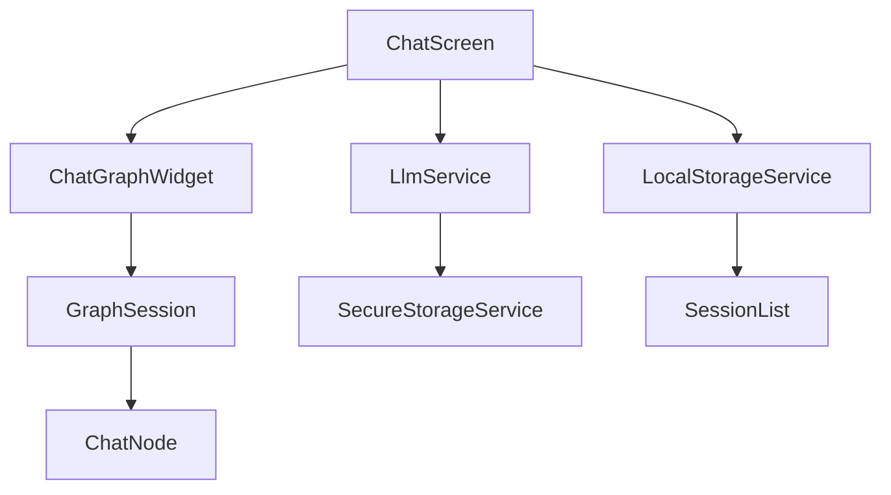
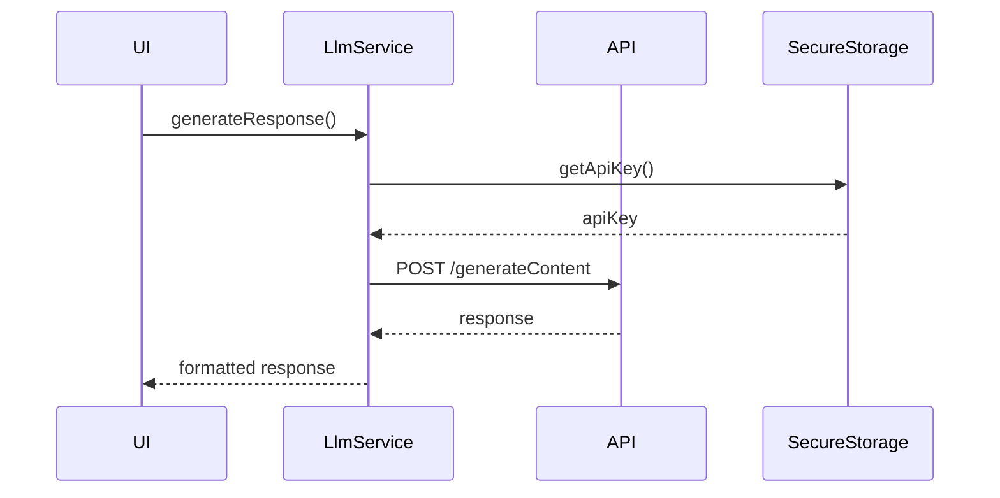
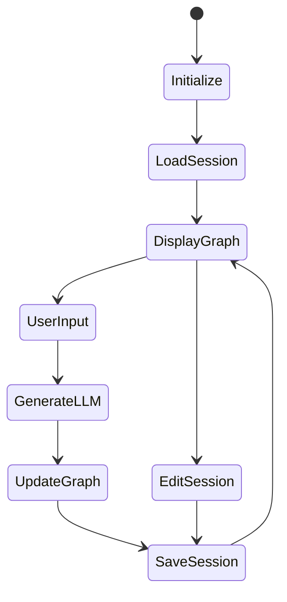

# LLM Graph Chat コアアーキテクチャ分析

## システム概要



## データモデル

### ChatNode

```dart
class ChatNode {
  final String id;
  final String? parentId;
  final String userInput;
  String llmOutput;
  final List<String> childrenIds;
  final DateTime timestamp;
  bool isCollapsed;
}
```

**特徴と役割**:
1. ツリー構造のノード表現
2. ユーザー入力とLLM出力の保持
3. 親子関係の管理
4. 折りたたみ状態の管理
5. JSONシリアライズ対応

### GraphSession

```dart
class GraphSession {
  final String id;
  final String title;
  final List<ChatNode> nodes;
  final String rootNodeId;
  final DateTime createdAt;
  DateTime updatedAt;
}
```

**特徴と役割**:
1. チャットセッションの管理
2. ノードのコレクション管理
3. タイムスタンプ管理
4. セッションの永続化

## サービス層

### LLMService



**主要機能**:
1. Google PaLM APIとの通信
2. チャット履歴の構築
3. API認証管理
4. エラーハンドリング
5. モデル選択機能

**改善ポイント**:
- レート制限の実装
- リトライ機構の追加
- 応答の検証強化
- キャッシュ機構の導入

### LocalStorageService

**役割**:
1. セッションの永続化
2. 設定の保存
3. オフライン対応

## アプリケーションフロー



## セキュリティ考慮事項

1. **API キー管理**:
   - SecureStorageServiceによる暗号化保存
   - キーの有効性検証

2. **データ保護**:
   - ローカルストレージの暗号化
   - センシティブデータの分離

3. **エラー処理**:
   - APIエラーの適切な処理
   - ユーザーへの明確なフィードバック

## パフォーマンス最適化

### メモリ管理

1. **セッションデータ**:
   - 大規模セッションの分割読み込み
   - 未使用ノードの解放

2. **API通信**:
   - 応答のキャッシュ
   - バックグラウンド処理

### ストレージ最適化

1. **永続化戦略**:
   - 差分更新の実装
   - 自動クリーンアップ

2. **キャッシュ管理**:
   - LRUキャッシュの導入
   - 期限切れデータの削除

## 改善提案

### 短期的な改善

1. **エラーハンドリング強化**
   - より詳細なエラーメッセージ
   - リカバリーメカニズム

2. **パフォーマンス最適化**
   - レスポンスキャッシュ
   - バックグラウンド同期

3. **UX改善**
   - プログレス表示の強化
   - オフライン対応の改善

### 中長期的な改善

1. **アーキテクチャ刷新**
   ```mermaid
   graph TD
       A[UIレイヤー] --> B[Presentation層]
       B --> C[Domain層]
       C --> D[Data層]
       D --> E[Infrastructure層]
   ```

2. **新機能追加**
   - マルチモデルサポート
   - プラグイン機構
   - 協調編集機能

3. **スケーラビリティ**
   - データベース統合
   - クラウド同期
   - マルチデバイス対応

## テスト戦略

1. **単体テスト**
   - モデルのシリアライズ
   - ビジネスロジック
   - API通信

2. **結合テスト**
   - セッション管理
   - データ永続化
   - UI操作

3. **E2Eテスト**
   - ユーザーフロー
   - エラー処理
   - パフォーマンス

## 開発ガイドライン

1. **コーディング規約**
   - Flutter/Dartベストプラクティス
   - エラー処理ガイドライン
   - ドキュメント規約

2. **アーキテクチャ原則**
   - 関心の分離
   - 依存性注入
   - SOLID原則の遵守

3. **品質基準**
   - コードカバレッジ目標
   - パフォーマンス指標
   - アクセシビリティ要件