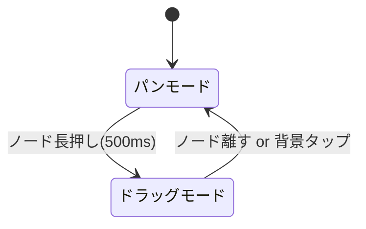

# Graph UI 改善計画

## 目的
チャットグラフウィジェットのノード操作をより直感的でわかりやすく改善する

## 現在の問題点
1. ドラッグ操作とパン操作の競合
2. 初期レイアウトの不足（ノードが重なって表示される）
3. ドラッグ操作時のフィードバック不足
4. 接続線の見づらさ

## 改善内容

### 1. 操作モードの分離
- **パンモード** (デフォルト):
  - 2本指ジェスチャーでズーム/パン可能
  - シングルタップでノード選択
- **ドラッグモード**:
  - ノードを長押し(500ms)で移行
  - シングルタップでノード移動
  - ノード離す or 背景タップでパンモードに戻る



### 2. 自動レイアウトアルゴリズム
- ルートノードを左から右に配置
- 子ノードは親ノードの下にインデントして配置
- 折りたたみ状態に応じて子ノードを非表示

```dart
void _calculateLayout() {
  // ルートノードを水平方向に配置
  final rootNodes = _getRootNodes();
  double x = 100;
  
  for (final node in rootNodes) {
    _layoutNode(node, x, 100);
    x += 250;
  }
}

void _layoutNode(ChatNode node, double x, double y) {
  _positions[node.id] = Offset(x, y);
  
  if (!node.isCollapsed) {
    double childY = y + 150;
    for (final childId in node.childrenIds) {
      _layoutNode(_nodes[childId]!, x + 50, childY);
      childY += 150;
    }
  }
}
```

### 3. ドラッグUX改善
- **視覚的フィードバック**:
  - ドラッグ中はノードの影を強調
  - 接続線をハイライト表示
- **スナップ機能**:
  - グリッドスナップ (20px間隔)
  - 他のノードに近づいた時に磁石効果

### 4. 接続線の改善
- **スタイル改善**:
  - 選択ノード: 太い線 (2.5px) + アクセントカラー
  - 通常時: 細い線 (1px) + グレー
- **曲線の滑らかさ向上**:
  - ベジェ曲線の制御点を最適化

## 実装ステップ

| タスク | 所要時間 | 優先度 |
|--------|----------|--------|
| 操作モード分離 | 1.5日 | High |
| 自動レイアウト | 1日 | High |
| ドラッグフィードバック | 1日 | Medium |
| 接続線改善 | 0.5日 | Medium |
| テスト/調整 | 1日 | High |

## テストケース
1. ノード長押しでドラッグモードに移行できるか
2. 自動レイアウトが適切に機能するか
3. 折りたたみ時に子ノードが正しく非表示になるか
4. 接続線のハイライトが機能するか

## 備考
- 既存の`InteractiveViewer`の挙動を維持しつつ、操作感を改善
- テーマカラーに対応した接続線のスタイルを実装