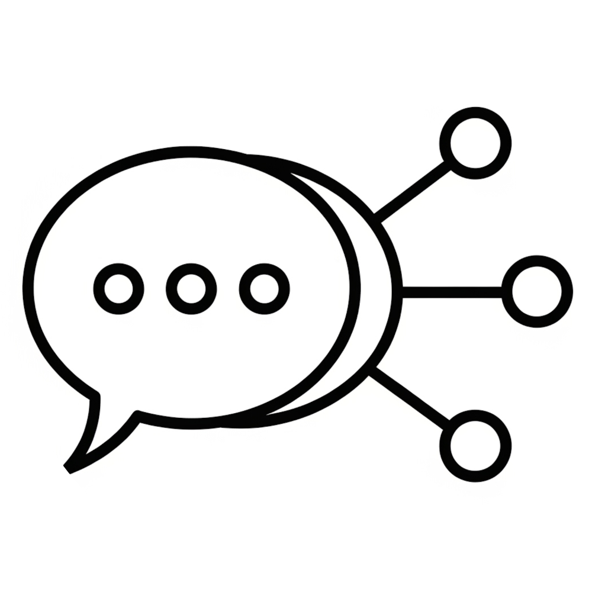
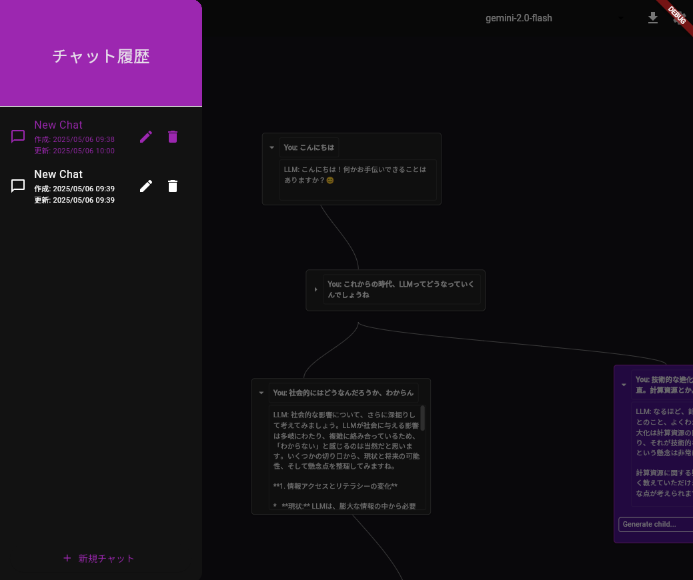

  

    <h1 style="margin:0;">LLM Graph Chat</h1>
    
LLMとの会話をツリー状に可視化するチャットアプリ

  

  

  

    <ul style="padding-left:1.1em; font-size:0.95em; line-height:1.5;">
      <li><strong>会話の地図を描く</strong>: ノードごとにユーザー入力とLLM応答を一覧し、枝分かれで思考の幅を可視化</li>
      <li><strong>分岐して深掘り</strong>: 任意ノードから派生質問や再生成が可能で、比較検討やブレインストーミングがしやすい</li>
      <li><strong>Gemini連携 & モデル選択</strong>: 複数Geminiモデルから用途に合わせて選択、設定画面でAPIキーを安全に管理</li>
      <li><strong>Flutterマルチプラットフォーム</strong>: 1つのコードベースでモバイル / デスクトップ / Web へ展開</li>
    </ul>
    
アイデア整理・探索・チームディスカッションに。

  

  

    
    

      

        
        Webデモ
      

      

        
        GitHub
      

    

  

