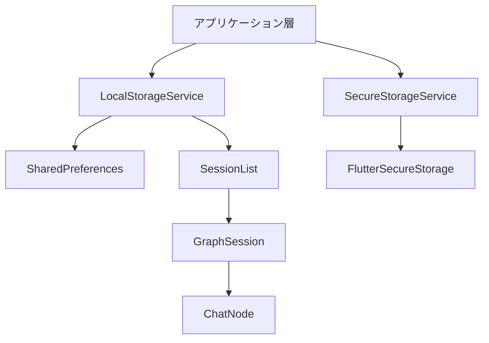
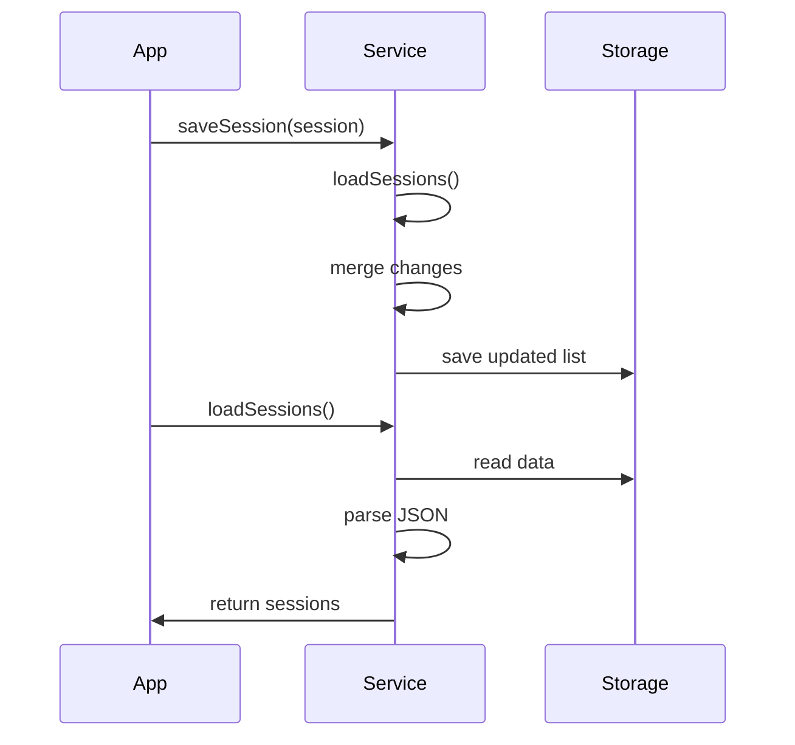
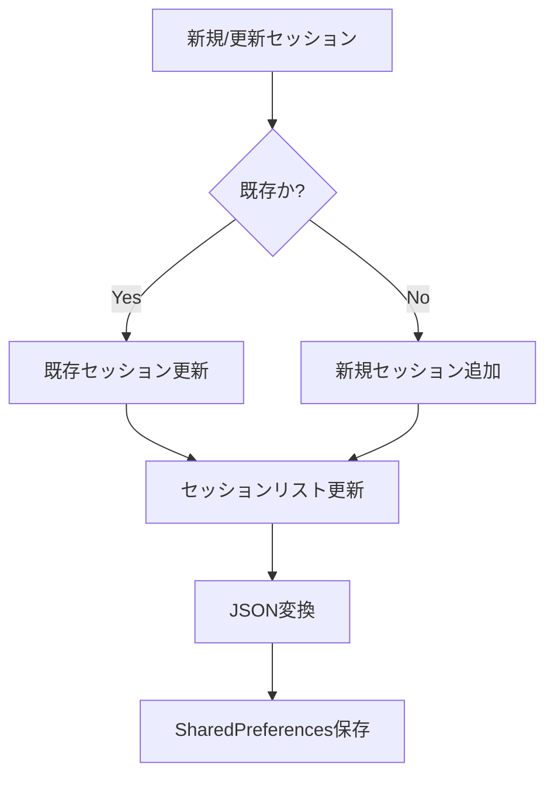
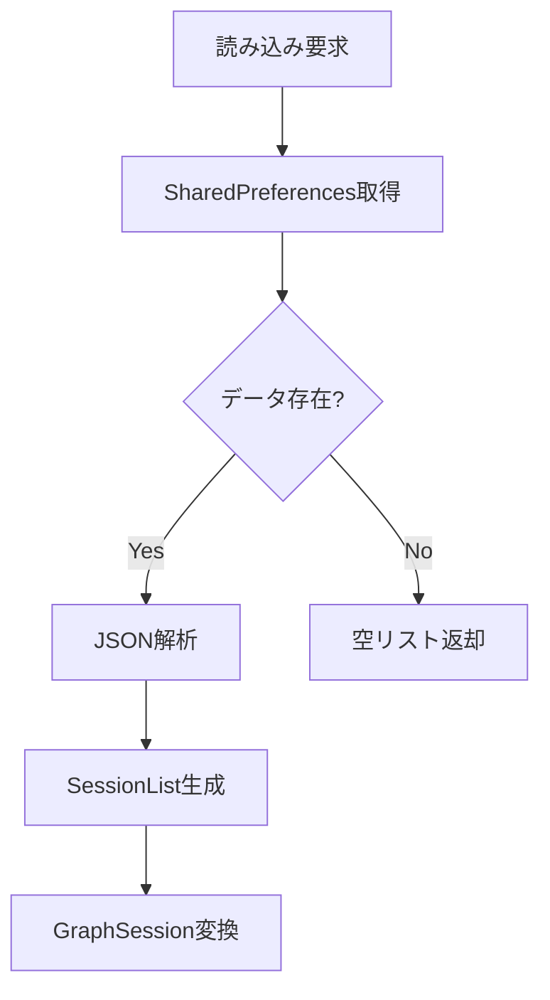
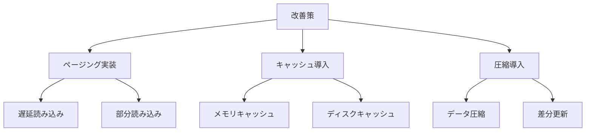
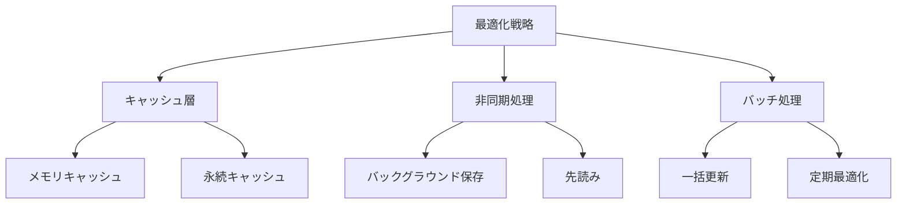
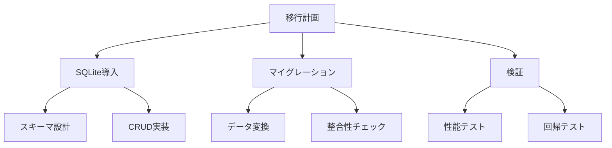

# データ永続化層の分析

## アーキテクチャ概要



## LocalStorageService

### 責務
1. チャットセッションの永続化
2. アプリケーション設定の管理
3. UIレイアウト設定の保存

### データ構造

```dart
// セッション管理のキー
static const String _sessionsKey = 'chat_sessions';

// UI設定のキー
static const String _darkModeKey = 'dark_mode';
static const String _nodeWidthKey = 'node_width';
static const String _nodeHeightKey = 'node_height';
```

### 主要機能

#### 1. セッション管理


**実装の特徴**:
- JSONによるシリアライズ
- 差分更新の実装
- エラー処理とリカバリー

#### 2. 設定管理
- ダークモード設定
- ノードサイズ設定
- デフォルト値の提供

## データの永続化フロー

### 1. セッションの保存


### 2. セッションの読み込み


## 技術的課題と改善提案

### 1. スケーラビリティ

**現状の課題**:
- 全セッションの一括読み込み
- メモリ使用量の増大
- パフォーマンスの低下

**改善案**:


### 2. データ整合性

**現状の課題**:
- 同時更新の制御なし
- トランザクション未実装
- エラー回復メカニズム不足

**改善提案**:
1. バージョン管理の導入
2. トランザクションサポート
3. データバックアップ機能

### 3. パフォーマンス最適化

**実装案**:


## 移行戦略

### 1. データベースへの移行



### 2. キャッシュ戦略

1. **メモリキャッシュ**:
   - LRUキャッシュの実装
   - サイズ制限の導入
   - 有効期限管理

2. **永続キャッシュ**:
   - ディスクキャッシュの実装
   - 差分更新の最適化
   - 自動クリーンアップ

## テスト戦略

### 1. 単体テスト
- データ変換処理
- CRUD操作
- エラー処理

### 2. 統合テスト
- 永続化フロー
- 非同期処理
- エッジケース

### 3. パフォーマンステスト
- 大規模データセット
- 同時操作
- メモリ使用量

## セキュリティ考慮事項

### 1. データ保護
- 機密情報の暗号化
- アクセス制御
- データの検証

### 2. エラー処理
- 例外のログ記録
- リカバリー手順
- ユーザー通知

## 今後の展開

1. **短期的な改善**:
   - エラーハンドリングの強化
   - パフォーマンス最適化
   - メモリ使用量の削減

2. **中期的な計画**:
   - データベース移行
   - キャッシュ層の実装
   - バックアップ機能

3. **長期的なビジョン**:
   - クラウド同期
   - マルチデバイス対応
   - リアルタイム更新