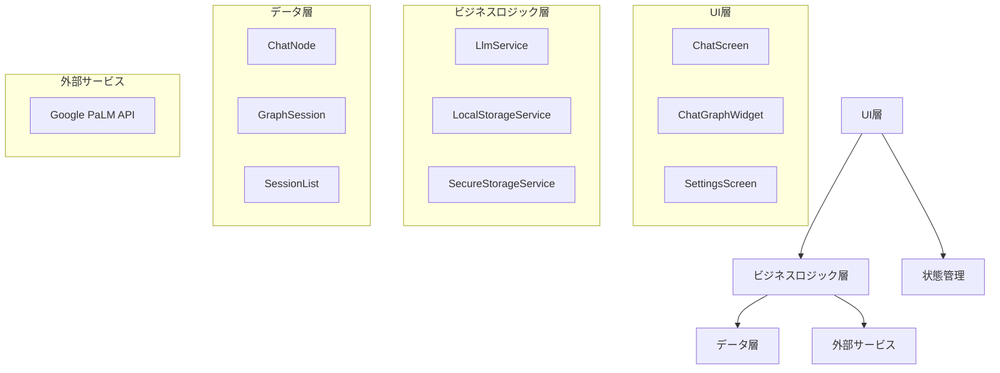
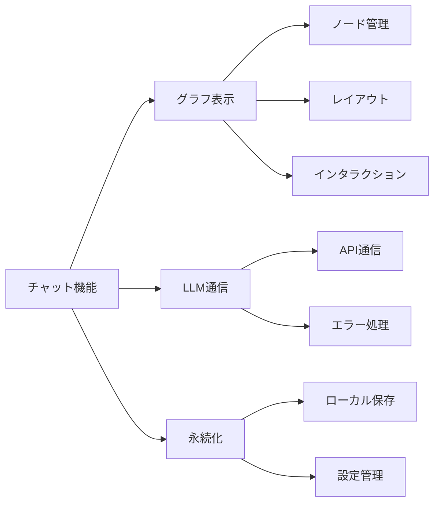
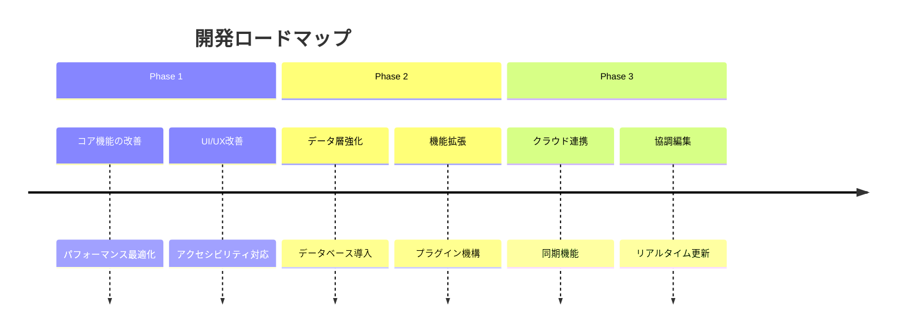

# LLM Graph Chat プロジェクト概要

## アーキテクチャ全体像

## コンポーネント構成

### 1. モデル層
- **ChatNode**: チャットの個々のノードを表現
- **GraphSession**: チャットセッション全体を管理
- **SessionList**: 複数セッションの管理

### 2. サービス層
- **LlmService**: LLM APIとの通信を管理
- **LocalStorageService**: データの永続化を担当
- **SecureStorageService**: 機密情報の管理

### 3. UI層
- **ChatGraphWidget**: グラフ表示とインタラクション
- **ChatScreen**: メイン画面の管理
- **SettingsScreen**: 設定画面の管理

## 主要機能

### 1. チャットグラフ
- ノードの表示と管理
- インタラクティブな操作
- レイアウトの自動計算

### 2. LLM連携
- APIキー管理
- モデル選択
- レスポンス処理

### 3. データ管理
- セッションの永続化
- 設定の保存
- セキュアなデータ管理

## 技術スタック

1. **フレームワーク**
   - Flutter
   - Provider (状態管理)

2. **外部サービス**
   - Google PaLM API

3. **ローカルストレージ**
   - SharedPreferences
   - FlutterSecureStorage

## セキュリティ要件

1. **データ保護**
   - APIキーの暗号化
   - センシティブデータの保護
   - セキュアな通信

2. **アクセス制御**
   - 認証管理
   - エラー処理
   - ログ制御

## 今後の展開

### 短期目標
1. パフォーマンス最適化
2. エラーハンドリング強化
3. UI/UX改善

### 中期目標
1. データベース移行
2. テスト強化
3. 機能拡張

### 長期目標
1. クラウド同期
2. マルチデバイス対応
3. プラグイン機構

## 関連ドキュメント

1. [コード分析](chat_graph_code_analysis.md)
   - コンポーネントの詳細分析
   - 技術的負債と改善提案

2. [インタラクションフロー](chat_graph_interaction_flow.md)
   - ユーザー操作の流れ
   - 状態遷移の詳細

3. [レンダリング実装](chat_graph_rendering_analysis.md)
   - 描画システムの解説
   - パフォーマンス最適化

4. [コアアーキテクチャ](core_architecture_analysis.md)
   - システム構成の詳細
   - データフローの解説

5. [永続化層](persistence_layer_analysis.md)
   - データ保存の実装
   - 最適化戦略

6. [セキュリティ実装](security_implementation_analysis.md)
   - セキュリティ機能の詳細
   - 改善提案

## 開発ガイドライン

### 1. コーディング規約
- Flutterベストプラクティス
- エラー処理ガイドライン
- セキュリティガイドライン

### 2. レビュー基準
- コードレビュー要件
- テスト要件
- ドキュメント要件

### 3. 品質基準
- パフォーマンス指標
- セキュリティ要件
- アクセシビリティ要件