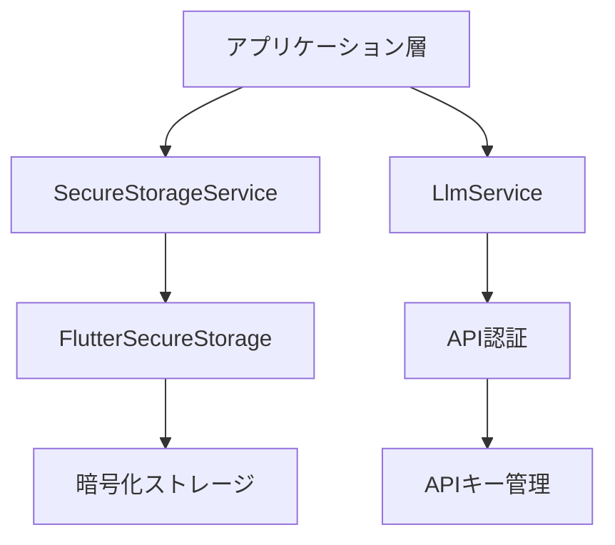
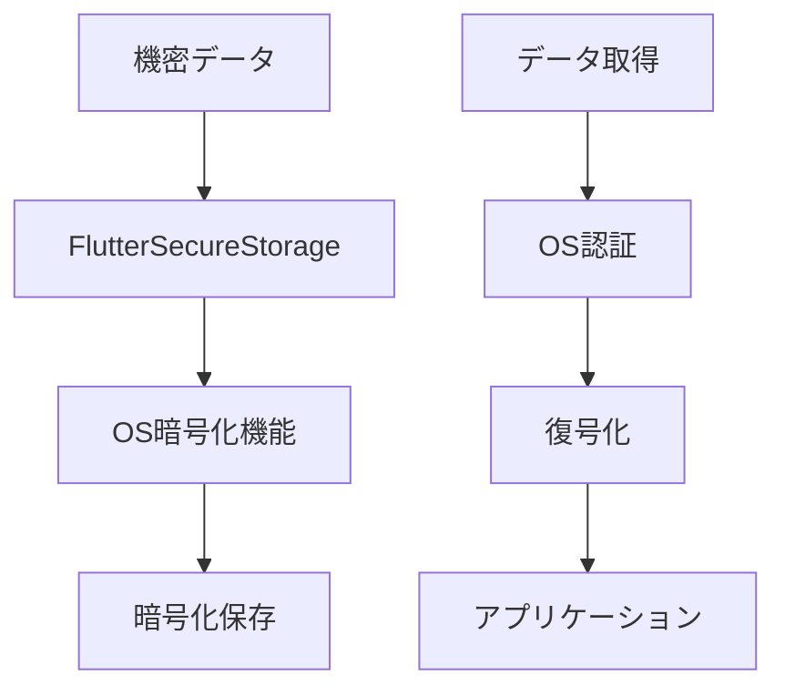
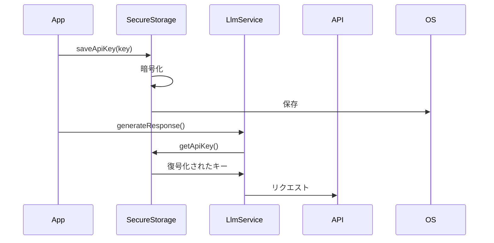
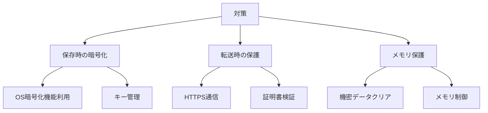
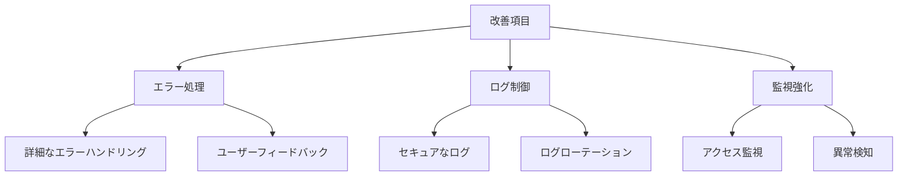

# セキュリティ実装の分析

## 概要



## セキュアストレージの実装

### SecureStorageService

```dart
class SecureStorageService {
  final _storage = const FlutterSecureStorage();
  static const _apiKeyKey = 'llm_api_key';
  static const _selectedModelKey = 'selected_llm_model';
}
```

#### 主要機能

1. **APIキー管理**
   - 保存 (`saveApiKey`)
   - 取得 (`getApiKey`)
   - 削除 (`deleteApiKey`)

2. **モデル選択管理**
   - 保存 (`saveSelectedModel`)
   - 取得 (`getSelectedModel`)
   - 削除 (`deleteSelectedModel`)

## セキュリティ機能

### 1. データ暗号化



#### プラットフォーム別実装
- **iOS**: Keychain Services
- **Android**: EncryptedSharedPreferences
- **その他**: プラットフォーム固有の暗号化機能

### 2. APIキーの保護



## セキュリティ上の考慮事項

### 1. データ保護

1. **保存データ**
   - APIキーの暗号化
   - 選択モデルの保護
   - 一時データの安全な削除

2. **メモリ保護**
   - 機密データのメモリからのクリア
   - デバッグログの制御
   - メモリダンプ対策

### 2. アクセス制御

1. **認証管理**
   - APIキーの有効性確認
   - アクセス権限の確認
   - セッション管理

2. **エラー処理**
   - セキュアなエラーメッセージ
   - 例外の適切な処理
   - ログの制御

## 脆弱性対策

### 1. データ漏洩防止



### 2. アクセス制御強化

1. **認証フロー**
   - APIキー検証
   - エラー時の適切な処理
   - リトライ制限

2. **権限管理**
   - 最小権限の原則
   - アクセス監視
   - 異常検知

## 改善提案

### 1. 短期的な改善



1. **セキュリティ強化**
   - キーローテーション機能
   - アクセスログ実装
   - 暗号化強化

2. **エラーハンドリング**
   - 詳細なエラー分類
   - リカバリー手順
   - ユーザー通知

### 2. 中長期的な改善

1. **認証システム**
   - 多要素認証
   - バイオメトリクス認証
   - セッション管理

2. **監視システム**
   - アクセスログ分析
   - 異常検知
   - 自動対応

## セキュリティテスト

### 1. 単体テスト

- 暗号化機能
- キー管理
- エラー処理

### 2. 統合テスト

- 認証フロー
- データ保護
- アクセス制御

### 3. ペネトレーションテスト

- 脆弱性スキャン
- 侵入テスト
- ストレステスト

## ガイドライン

### 1. セキュアコーディング

1. **データ処理**
   - 入力検証
   - サニタイズ処理
   - エスケープ処理

2. **エラー処理**
   - 例外の適切な処理
   - エラーメッセージの制御
   - ログ出力の制御

### 2. レビュー基準

1. **コードレビュー**
   - セキュリティチェック
   - 脆弱性確認
   - ベストプラクティス

2. **テスト基準**
   - カバレッジ要件
   - セキュリティテスト
   - パフォーマンス要件

## まとめ

現状の実装は基本的なセキュリティ機能を提供していますが、以下の点での改善が推奨されます：

1. **機能強化**
   - キーローテーション
   - アクセスログ
   - 異常検知

2. **監視体制**
   - ログ分析
   - アラート設定
   - インシデント対応

3. **ドキュメント整備**
   - セキュリティガイドライン
   - インシデント対応手順
   - 運用マニュアル